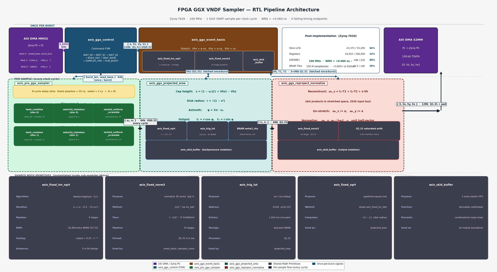

# FPGA GGX VNDF Sampler

An FPGA-accelerated pipeline for GGX Visible Normal Distribution Function (VNDF) sampling, implemented on the Zynq-7020 (Pynq-Z2). Achieves ~100 M samples/sec — roughly **2,500× faster than NumPy** and **5,000× faster than pure Python**.



## Overview

GGX VNDF sampling generates microfacet half-vectors for physically-based rendering. Each sample requires a Sobol quasi-random draw, scrambling, trigonometric evaluation, and multiple Newton-Raphson inverse-square-root iterations — compute-intensive enough to bottleneck real-time ray tracers when run on a CPU.

This design implements the full sampling pipeline as an AXI4-Stream accelerator. The Zynq PS sends a 3-beat command over AXI DMA, the PL streams back N half-vector samples as 96-bit `{hz, hy, hx}` Q1.31 values.

## Architecture

### Command Interface (MM2S → PL)

Three 64-bit beats per burst command:

| Beat | Contents |
|------|----------|
| 0 | `{seed_base[31:0], burst_len[15:0], unused[15:0]}` |
| 1 | `{view_y[31:0], view_x[31:0]}` |
| 2 | `{alpha[31:0], view_z[31:0]}` |

### Output Interface (PL → S2MM)

128-bit beats (96-bit payload, zero-padded): `{0[31:0], hz[31:0], hy[31:0], hx[31:0]}`

### Pipeline Modules

| Module | Function |
|--------|----------|
| `axis_ggx_control` | Top-level FSM: parses command beats, sequences once-per-burst event_basis computation, then drives per-sample datapath |
| `axis_ggx_event_basis` | Once-per-burst: computes orthonormal basis {Vh, T1, T2} from the view direction and alpha |
| `axis_pre_ggx_sampler` | Per-sample: stateless Sobol 2D + nested uniform scrambling → (u1, u2) |
| `axis_ggx_projected_area` | Per-sample: computes blend coefficients (t1, t2) from u1, u2, Vh_z, alpha |
| `axis_ggx_reproject_normalize` | Per-sample: reprojects sample into world space and normalizes to unit half-vector |
| `axis_sobol2d_stateless` | Gray-code Sobol sequence (random-access, no state) |
| `axis_nested_uniform_scramble` | Owen-like nested uniform scrambling |
| `axis_fixed_inv_sqrt` | 9-stage Newton-Raphson inverse square root (16K-entry BRAM LUT + 1 refinement step) |
| `axis_fixed_norm3` | 10-stage fixed-point 3D normalization |
| `axis_fixed_sqrt` | Fixed-point square root |
| `axis_trig_lut` | Trigonometric LUT (sine/cosine) |
| `axis_skid_buffer` | 1-entry AXI4-Stream skid buffer for pipeline back-pressure |

### Fixed-Point Formats

- **Q1.31 signed**: unit-vector quantities, range ≈ −1 to +1
- **UQ0.32 unsigned**: random variables, alpha, sqrt arguments
- **Q7.25**: `axis_fixed_inv_sqrt` output

## Implementation Results

Target: 100 MHz on Zynq-7020 (Pynq-Z2)

| Metric | Value |
|--------|-------|
| WNS | **+0.060 ns** (timing closed) |
| Slice LUTs | 23,373 / 53,200 (44%) |
| Flip-Flops | 24,052 / 106,400 (23%) |
| DSP48E1 | 196 / 220 (89%) |
| Block RAM Tiles | 40.5 / 140 (29%) |

### Throughput

| Implementation | Samples/sec | Speedup vs Python |
|----------------|-------------|-------------------|
| FPGA (this work) | ~100,000,000 | ~5,000× |
| NumPy (vectorized) | ~39,000 | ~2× |
| Python (scalar) | ~19,000 | 1× |

## Repository Structure

```
hdl/               SystemVerilog/Verilog RTL sources
sim/               Cocotb testbenches and Python simulation scripts
vivado/            Bitstream (design_1_wrapper.bit) and hardware handoff (design_1.hwh)
block_diagram.py   Matplotlib pipeline diagram source
block_diagram.png  Pipeline block diagram
report_updated.tex LaTeX report source
```

## Simulation

Requires [cocotb](https://www.cocotb.org/) and [Icarus Verilog](http://iverilog.icarus.com/). All tests are in `sim/`.

```bash
source /path/to/.venv/bin/activate
cd sim/

# Unit tests
python test_fixed_inv_sqrt.py     # 9-cycle latency, tol 2e-2
python test_fixed_sqrt.py
python test_fixed_norm3d.py       # 10-cycle latency
python test_trig_lut.py
python test_sobol2d.py
python test_nus.py

# Integration tests
python test_ggx_event_basis.py
python test_ggx_projected_area.py
python test_ggx_reproject_normalize.py
python test_ggx_control.py        # full pipeline, 480 outputs, max err < 6.5e-2
```

## Running on Hardware (Pynq-Z2)

Copy `vivado/design_1_wrapper.bit` and `vivado/design_1.hwh` to the board. The notebook `sim/shuf_scr_ggx.ipynb` contains the PS-side driver using `pynq.lib.dma`.

```python
from pynq import Overlay
import numpy as np

ol = Overlay("design_1_wrapper.bit")
dma = ol.axi_dma_0

# Build command buffer (3 × 64-bit beats, little-endian)
cmd = np.zeros(6, dtype=np.uint32)
cmd[0] = seed_base
cmd[1] = burst_len & 0xFFFF
cmd[2] = view_x_q131
cmd[3] = view_y_q131
cmd[4] = view_z_q131
cmd[5] = alpha_uq032

dma.sendchannel.transfer(cmd_buf)
dma.recvchannel.transfer(out_buf)   # out_buf: burst_len × 4 uint32
dma.sendchannel.wait()
dma.recvchannel.wait()

# Each 128-bit output word: [unused, hz, hy, hx] Q1.31
samples = out_buf.reshape(-1, 4)[:, 1:].astype(np.int32) / 2**31
```

## References

- Heitz, E. (2018). *Sampling the GGX Distribution of Visible Normals.* JCGT 7(4).
- Joe, S. & Kuo, F.Y. (2010). *Constructing Sobol Sequences with Better Two-Dimensional Projections.* SIAM J. Sci. Comput.
