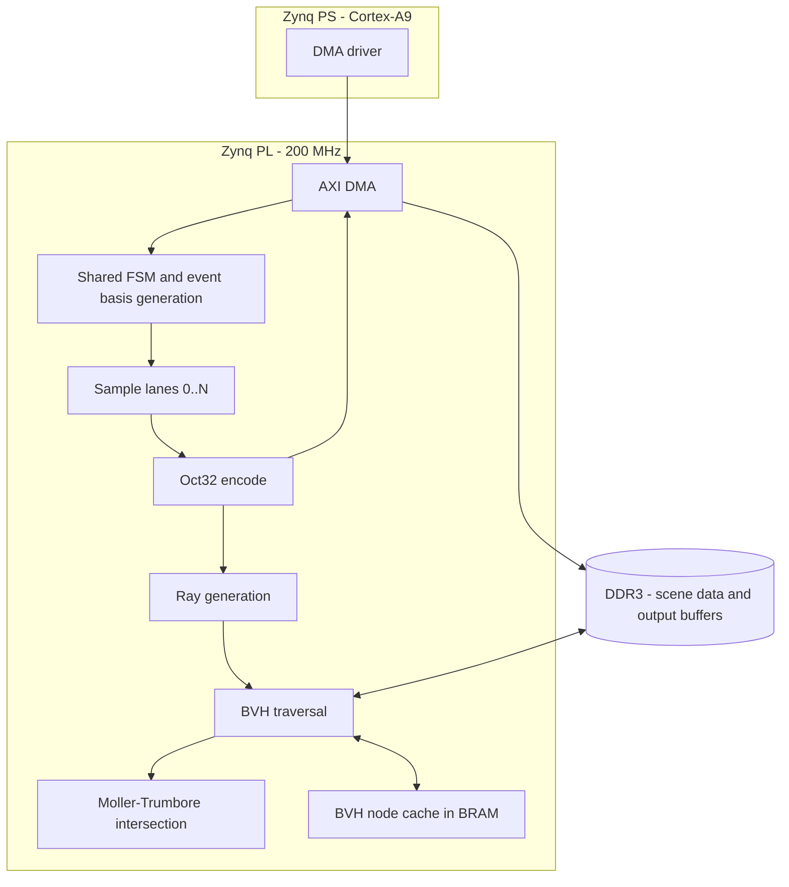

# Roadmap — parked work

Long-term intent for the project. **None of this is current work.** The current plan is
[REFACTOR_PLAN.md](./REFACTOR_PLAN.md): close one Lane at 200 MHz. Everything here is premised on that
Lane existing, and the numbers below should be re-derived once it does.

Octahedral encoding used to live here as a bandwidth feature. It has moved into the current plan as a
timing lever — see [ADR-0001](./adr/0001-octahedral-output-deletes-the-per-sample-normalize.md).

Vocabulary follows [CONTEXT.md](../CONTEXT.md).

---

## System vision



---

## Multi-lane expansion

Target: **5 Lanes at 200 MHz = 1.0 Gsample/s.**

This is a **3-way bin-pack** over the xc7z020's DSP (220), LUT (53k) and BRAM (140) budgets, not a
simple replication. A single Lane currently sits at 85 DSP, so five identical Lanes do not fit on the
DSP axis alone — the Lanes may need to be **heterogeneous**, some DSP-based and some DSP-free fabric,
chosen to balance across the device's resource columns rather than to minimize any one number.

Open questions, all of which need post-closure data:

- What does one closed Lane actually cost on each of the three axes? Every number predating closure is
  stale, and the octahedral change removes the largest block in the design.
- Is the Per-burst event basis stage shared across Lanes or replicated per Lane? Sharing saves a lot
  (it is already Folded and sequential) but creates a fan-out and a scheduling problem.
- Does the shared FSM's index counter widen to stride by the Lane count, or does each Lane carry its
  own index generator?
- How do Lane outputs merge — a single wide bus, or a packing FIFO?

## Bandwidth budget

The Zynq-7020's DDR3 bus is ~4.26 GB/s. At 1 Gsample/s:

| Output format | Bytes/Sample | Bandwidth | Fits? |
| :--- | ---: | ---: | :--- |
| 96-bit vector padded to 128 | 16 | 16 GB/s | No |
| Oct32 (2×16b) | 4 | 4 GB/s | Marginal — contends with BVH traffic |
| Oct16 (2×8b) | 2 | 2 GB/s | Yes |

Oct32 is the width chosen for accuracy reasons (ADR-0001) and is *marginal* at five Lanes once the BVH
engine is also reading DDR3. If bandwidth turns out to be the binding constraint at full Lane count,
the options are to revisit the field width with measured distribution data, to consume Samples
directly in the PL rather than round-tripping through DDR3, or to run fewer Lanes.

## Zybo Z7-20 bring-up

The tracked `vivado/design_1_wrapper.bit` is the **old pre-refactor design** and is not evidence of
anything current. No `create_bd.tcl` exists.

- Create a Vivado project on `xc7z020clg400-1` with the Zybo Z7-20 board preset (PS DDR3 timings,
  peripherals).
- Build the AXI DMA block design connecting PL to the AXI HP ports. Reuse the `create_bd.tcl` and
  PYNQ Overlay pattern from the `timing-recovery-loop` repo rather than writing one from scratch.
- Host software: PYNQ Overlay first for fastest iteration; a bare-metal Vitis application using
  `xaxidma.h` if the overhead matters.
- **In-context timing closure is a separate milestone from OOC closure** and will be worse. Expect to
  re-open the timing work once the design sits inside a real block design.

## BVH ray tracing engine

Consume Samples directly in the PL instead of writing them to DDR3.

```
[ Sample lanes ] -> [ Oct32 ] -> [ Ray generation ] -> [ BVH traversal ] <-> [ BRAM node cache ]
                                                              |
                                                              v
                                                   [ Moller-Trumbore ] -> [ Shading ]
```

- Scene BVH and triangle data in DDR3, reached over AXI HP.
- Traversal FSM performing ray-box tests against bounding-box nodes.
- Use leftover BRAM (~500 KB) as a read-only cache for the top 3–4 levels of the tree.
- Pipelined Möller-Trumbore intersection on leaf hits; hit distance and normal feed a shading stage
  that uses the GGX Sample.

Risk worth recording now: the sampler and the BVH engine contend for both DDR3 bandwidth and the same
three PL resource budgets. The bin-pack in the multi-lane section is really a bin-pack over
*everything on the die*, and Lane count is the variable most likely to give.
